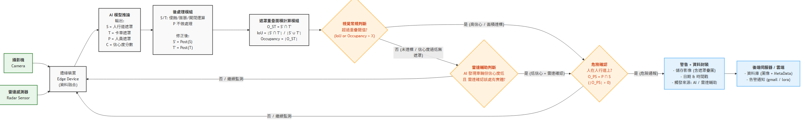
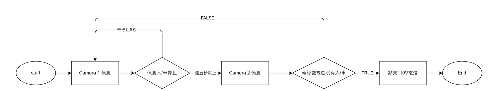
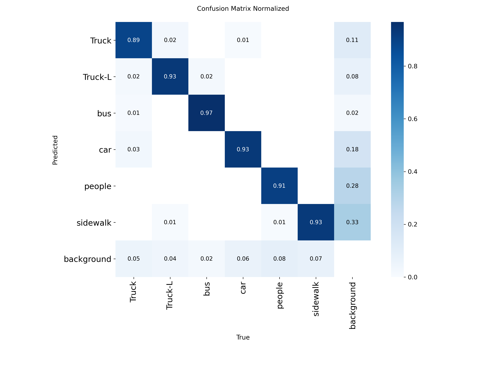

# 🚦 Edge AI 智慧路口：主動安全防護與動態號誌節能系統
基於 YOLOv11 與 TensorRT 的 Jetson Orin Nano 邊緣運算即時路口雙核心監控系統 

> **⚠️ 商業保密聲明 (NDA Disclaimer)** > 本專案為與業界廠商合作之真實落地項目（已於花蓮縣特定路口進行 POC 場域驗證）。為遵守商業保密協定，本開源儲存庫**僅提供系統架構展示與 AI 輕量化效能分析**。核心模型權重（`.pt` / `.engine`）與專有訓練資料集均存放於 Private Repository，不對外公開。

---

## 📖 專案總覽

本專案利用**邊緣運算（Edge AI）**與**電腦視覺（Computer Vision）**技術，打造具備「高韌性無線通訊」的智慧路口雙核心系統。不僅解決大型車輛（卡車、公車）內輪差違規駛入人行道的致命問題，更導入 **Agentic AI 自主決策機制**，動態消除路口無效紅燈怠速，實踐 ESG 淨零碳排。

系統部署於 **NVIDIA Jetson Orin Nano**，透過 RTSP 影像串流進行 24/7 即時監控，具備太陽能獨立供電。

---

## 🛡️ 雙核心系統架構

### 核心一：主動安全預警系統 (Active Safety System)

專注於解決大型車輛視野死角與內輪差造成的行人傷亡。

1. **影像輸入**：攝影機 RTSP 串流 + 雷達感測器資料融合（Sensor Fusion）。
2. **AI 模型推論**：YOLOv11s 實例分割，輸出人行道（S）、卡車（T）、行人（P）遮罩與信心分數。
3. **後處理模組**：形態學運算（Erode/Dilate）精煉遮罩邊緣，計算遮罩重疊面積（O_ST = S ∩ T）。
4. **決策與告警**：
   * 視覺高信心：IoU 或 Occupancy 超過門檻 → 觸發違規。
   * 雷達輔助共判：視覺低信心但持續偵測，且人在人行道上 → 觸發違規。
   * 輸出：自動雙軌錄影、Email 警報、LoRa 無線通報。

### 核心二：動態號誌節能系統 (Agentic AI Traffic Control)

專注於解決傳統定時號誌導致的「無對向來車卻空等」之怠速碳排浩劫。

1. **需求偵測 (Camera 1)**：監控紅燈停等區，當偵測到車輛或行人靜止等待超過 **5 秒**，啟動查核機制。
2. **淨空確認 (Camera 2)**：聯動監控對向 160 公尺外車道，連續偵測 **10 秒** 確認達到「絕對淨空」標準。
3. **介入放行**：當「有人空等」且「對向淨空」條件同時成立，Edge AI 自主干涉紅綠燈，紅燈變成綠燈，**無需破壞既有號誌電路，直接消滅無效怠速**。

---

## 🧠 AI 技術與框架

| 項目 | 技術 |
|------|------|
| 核心演算法 | `YOLOv11s` 實例分割（Instance Segmentation） |
| 邊緣部署框架 | NVIDIA `TensorRT` 底層硬體加速 |
| 邊緣控制 | `Edge AI` 邏輯決策 + 繼電器硬體控制 (GPIO) |
| 計算精度 | `FP16` 半精度浮點數，契合 Tensor Core 算力 |
| 開發環境 | `Docker` / `PyTorch` / `OpenCV` |
| 硬體平台 | NVIDIA Jetson Orin Nano 8GB |
| 標注工具 | `Roboflow`（多邊形標注 + 資料集版本管理） |

> 技術參考：[Ultralytics NVIDIA Jetson 部署指南](https://docs.ultralytics.com/zh/guides/nvidia-jetson/)

---

## 📊 資料集與標注

本專案使用 **Roboflow** 作為標注工具，對路口監視影像進行多邊形實例分割標注。

| 項目 | 內容 |
|------|------|
| 標注類別 | Truck / Truck-L / bus / car / people / sidewalk（6 類）|
| 標注類型 | 多邊形遮罩（Instance Segmentation）|
| 資料集版本 | v3（持續迭代擴充）|
| 工具 | Roboflow 標注平台 + 資料增強 |

---
### 🔬 模型量化精度與速度對比 (FP32 vs FP16)

將訓練完成的 YOLOv11s 模型從 PyTorch 格式（FP32）透過 TensorRT 編譯為邊緣裝置專屬推理引擎（FP16）後，我們進行了嚴格的精度損失評估。數據證明，我們在幾乎不犧牲安全防護力的前提下，換取了巨大的算力釋放：

| 指標 | FP32 (基準) | FP16 (量化後) | 損失 / 改善幅度 |
| :--- | :--- | :--- | :--- |
| **Mask mAP50** | 0.943 | 0.939 | -0.4% |
| **Mask mAP50-95** | 0.776 | 0.764 | -1.2% |
| **推理時間** | 49.2ms | 24.4ms | 🚀 **↓50%** |

> **結論**：FP16 量化後的 Mask mAP50 精度損失僅 0.4%，但推理時間直接砍半（下降 50%）。這完美的平衡點，正是系統能將總體 FPS 推升至 29.7、極限壓縮警報反應時間的核心關鍵。
## ⚡ AI 輕量化與效能驗證（消融實驗）

為克服邊緣裝置功耗上限（15W）、共享記憶體限制，並達到即時安全預警標準，系統性導入四大輕量化技術。

### 實測結果（Jetson Orin Nano）

| 評估指標 | 無輕量化基準 PyTorch FP32 | 優化完全體 TensorRT FP16 | 改善幅度 |
|:--------|:--------------------------|:--------------------------|:--------|
| **推論速度（FPS）** | 8.3 FPS | **29.7 FPS** | 🚀 **+258%** |
| **系統延遲** | 127 ms | **34 ms** | ⏱️ **↓73%** |
| **警報反應時間** | 0.64 秒 | **0.18 秒** | 🚨 **↓72%** (卡車位移 9m 縮減至 2.5m) |
| **每幀能耗** | 0.637 J/幀 | **0.215 J/幀** | 🔋 **↓66%** |
| **Mask mAP50** | 0.943 | **0.939** | 精度損失 **−0.4%** |

### 四大輕量化措施

| 措施 | 方法 | 效果 |
|------|------|------|
| **模型量化** | FP32 → FP16，TensorRT 編譯 | 推理時間 ↓50%，完美釋放 GPU 算力 |
| **跳幀推理** | Temporal Subsampling N=3 | 整體 FPS 8.3 → 29.7，突破即時門檻 |
| **資源管理** | psutil 非阻塞、resize 合併 | 消除每次監控的強制等待延遲 |
| **形態學過濾** | 無車輛/行人時直接跳過 | 降低純背景畫面的無效 CPU 運算 |

### 效能取捨分析
開發過程曾評估 `INT8` 量化，但因 YOLOv11s segmentation head 在 Jetpack6 TensorRT 上存在相容性問題導致匯出失敗，後續持續嘗試中。最終以 **TensorRT FP16 + 演算法快速過濾** 作為當前最佳平衡點，在幾乎無損精度的情況下，將警報反應時間壓縮至極限的 0.18 秒。

---

## 🎯 模型辨識能力

混淆矩陣顯示 FP32 基準模型六類平均辨識率達 **93%**：

FP16 量化後 Mask mAP50 僅下降 **0.4%**，確認輕量化工程不僅大幅降本增效，更絲毫未妥協真實路口的防護可靠度。

---

## ⚙️ 系統部署環境 (Deployment Environment)

本專案為實體落地系統，為確保高可用性與極低延遲，實際運行之軟硬體環境配置如下：

- **邊緣運算硬體**：NVIDIA Jetson Orin Nano (8GB)
- **作業系統**：Ubuntu 22.04 (NVIDIA JetPack 6)
- **AI 加速框架**：NVIDIA TensorRT (FP16 精度)
- **相依軟體**：Docker 容器化部署、OpenCV、PyTorch (僅用於模型預訓練與導出)
- **周邊感測與控制**：IP Camera (RTSP 串流)、LoRa 無線傳輸模組、實體繼電器 (GPIO 號誌控制)
